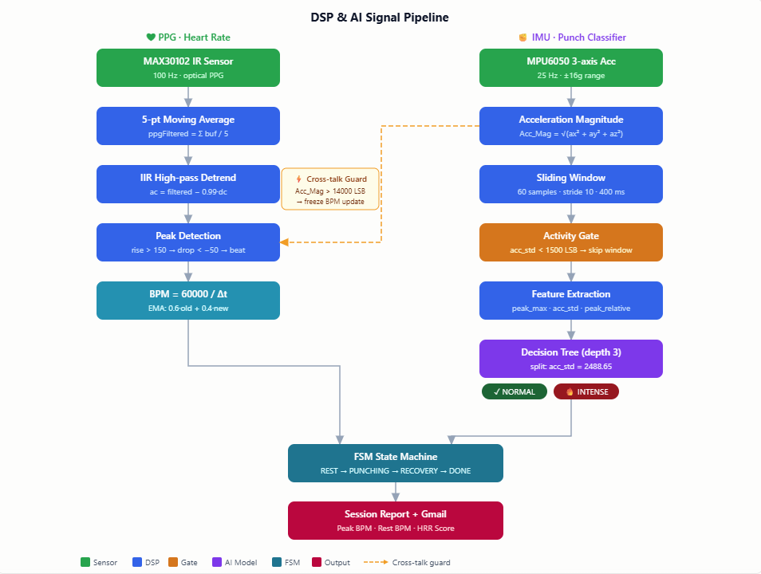
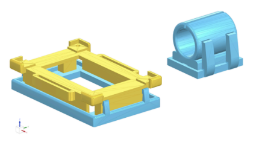
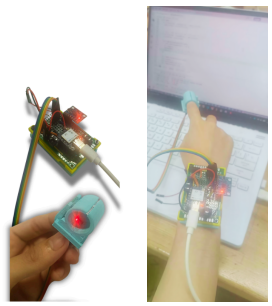

# punch-edge-ai

🇻🇳 [Đọc bằng tiếng Việt](README.vi.md)

A wrist device for martial-art training that classifies each punch as Normal or Intense and tracks heart rate recovery. **The AI model runs directly on the ESP32-S3 chip** - no phone or cloud needed. WiFi is only used at the end to send the session report by email.

**Course:** ENG209 Signals, Systems and Control — Fulbright University Vietnam  
**Team:**  
[Hoàng Nguyễn Ngọc Giang](https://www.linkedin.com/in/giang-ho%C3%A0ng/) - Signal Processing & AI  
[Phan Ngọc Quốc Duy](https://www.linkedin.com/in/duy-phan-ngọc-quốc-3a342a312) - Hardware  
[Trần Thanh Tùng](https://www.linkedin.com/in/t%C3%B9ng-tr%E1%BA%A7n/) - Hardware

---

## What it does

| Input | Processing | Output |
|-------|-----------|--------|
| MPU6050 — 3-axis acceleration @ 25 Hz | Sliding window → Decision Tree | **Normal** or **Intense** punch session |
| MAX30102 — infrared PPG @ 100 Hz | Moving avg → IIR detrend → peak detection | Real-time BPM |
| 60 s rest after punching stops | Peak BPM − Rest BPM | Heart Rate Recovery (HRR) score |


*Raw sensor signals: Acc\_Mag from MPU6050 (acceleration magnitude) and IR PPG from MAX30102 (heart rate optical signal)*

---

## System Pipeline


*End-to-end system pipeline: from sensor input to session report email*

---

## Signal Processing & AI



*DSP and AI pipeline: PPG heart rate processing (left) and IMU punch classifier with Decision Tree (right)*

**Key parameters:**
- Activity gate: `acc_std < 1500 LSB` → window skipped
- Decision Tree split: `acc_std = 2488.65` → Normal (0) or Intense (1)
- Cross-talk guard: if `Acc_Mag > 14000 LSB` (7g), BPM update frozen
- I2C watchdog: auto-recover in 20 ms, max 3 attempts

---

## Hardware

| Component | Role | Config |
|-----------|------|--------|
| Seeed Studio XIAO ESP32-S3 | Main MCU | 240 MHz, 512 KB SRAM |
| MPU6050 | IMU — acceleration | ±16g, I2C 0x68 |
| MAX30102 | PPG — optical heart rate | IR 940 nm, I2C 0x57 |



*3D Simulation*



*Prototype worn on wrist during testing*


Wiring: SDA = GPIO 5, SCL = GPIO 6, 400 kHz, 3.3 V.

---

## Setup

### 1. Configure credentials

Open [`firmware/main.cpp`](firmware/main.cpp) and fill in your values:

```cpp
#define WIFI_SSID       "your_wifi_name"
#define WIFI_PASSWORD   "your_wifi_password"
#define AUTHOR_EMAIL    "your_gmail@gmail.com"
#define AUTHOR_PASSWORD "xxxx xxxx xxxx xxxx"   // Gmail App Password
#define RECIPIENT_EMAIL "report_destination@gmail.com"
```

> The device works in **offline mode** if WiFi fails — it skips the email step.

### 2. Build and flash

```bash
# Requires PlatformIO CLI or VS Code + PlatformIO extension
pio run -e seeed_xiao_esp32s3 -t upload
pio device monitor   # 115200 baud
```

---

## Results

89.9% accuracy (LOGO cross-validation) across 10 test cases:

| Category | Result |
|----------|--------|
| Intense session detection | PASSED |
| Normal session — not oversensitive | PASSED |
| Activity gate at 1500 LSB | PASSED |
| Decision Tree boundary (acc_std 2400–2550) | PASSED |
| Motion-only not classified Intense | PASSED |
| Rotation invariance | PASSED |
| Rapid punching (3–4 punches/sec) | PASSED |
| Cross-talk guard during heavy impact | PASSED |
| FSM auto-renew after 3 s quiet period | PASSED |

**Demo video:** [Google Drive](https://drive.google.com/file/d/1EUahLwN11yc4-B6_D1cpn5PuJAG3qsEr/view?usp=sharing)

---

## Repo Structure

```
├── firmware/
│   ├── main.cpp          # Production firmware
│   └── classifier.h      # Decision Tree as C header
├── data/
│   ├── raw/              # Raw CSV sessions
│   └── processed/        # 39k labelled samples
├── notebooks/            # Model training + classifier.h export
├── scripts/              # Serial data collector
└── docs/
    ├── images/           # Diagrams and photos for this README
    └── visual_qc/        # QC plots per collection session
```

---

## What came next

This project was continued and redesigned with **FreeRTOS + BLE**, expanding from punch classification to 5 human activity classes (Walk / Run / Sit / Stand / Lying Down).

→ [wearable-health-monitor](https://github.com/ChuoiUhuhu0727/wearable-health-monitor)
